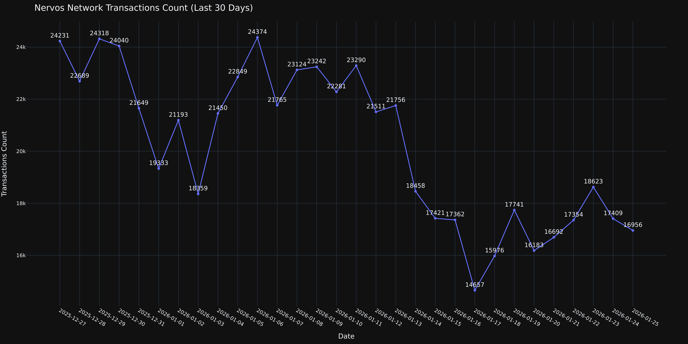

# CKB Report – Last 30 Days

该脚本用于从 **CKB Explorer** 拉取 CKB 相关指标数据，使用 **pandas / plotly** 进行统计与可视化，并通过 **Discord Webhook** 发送报告。

适合 **运维定时任务 / 报表自动化 / 无人值守运行** 场景。

----
## 🖥 环境要求

- Ubuntu 24.04
- Python 3.12
- 可访问 CKB Explorer API
- Discord Webhook

### 安装 Python 虚拟环境安装模块

```
sudo apt install python3.12-venv
```

### 创建并激活虚拟环境

```
python3.12 -m venv venv-report
source venv-report/bin/activate
```

### 安装依赖
```
pip install --upgrade pip
pip install -r requirements.txt
```

### 环境变量配置

cp -rp .env.example .env （x_api_key， ckb explorer 团队提供， discord_webhook 自己申请， Prometheus 私有，不提供，少1个图表）

### 执行脚本
```
source venv-report/bin/activate
python ckb_report_last_30_days.py
```

### 图表示例

